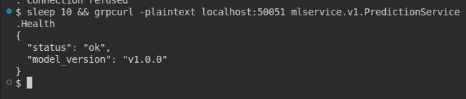
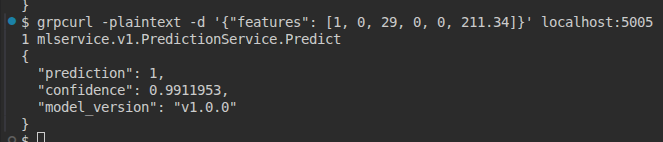

# ML gRPC Service — Titanic Survival Prediction

gRPC-сервис для предсказания выживания пассажиров Титаника. Реализован на Python с использованием scikit-learn, упакован в Docker-контейнер.

## Описание проекта

Сервис предоставляет два gRPC-метода:

- **Health** — проверка состояния сервиса и версии модели
- **Predict** — предсказание выживания на основе характеристик пассажира

### Входные признаки для Predict

| Признак | Описание                       | Значения             |
| ------- | ------------------------------ | -------------------- |
| Pclass  | Класс билета                   | 1, 2, 3              |
| Sex     | Пол                            | 0 = female, 1 = male |
| Age     | Возраст                        | число                |
| SibSp   | Кол-во братьев/сестёр/супругов | число                |
| Parch   | Кол-во родителей/детей         | число                |
| Fare    | Стоимость билета               | число                |

### Выходные данные

- `prediction`: 0 = Died, 1 = Survived
- `confidence`: уверенность модели (0.0 — 1.0)
- `model_version`: версия модели

## Структура проекта

```
HW2_MLOPS/
├── protos/
│   ├── model.proto          # Контракт API
│   ├── model_pb2.py         # Сгенерированный код
│   └── model_pb2_grpc.py
├── server/
│   └── server.py            # gRPC сервер
├── client/
│   └── client.py            # Тестовый клиент
├── models/
│   └── model.pkl            # Обученная модель
├── train_model.py           # Скрипт обучения
├── Dockerfile
├── requirements.txt
└── README.md
```

## Сборка и запуск

### Docker (рекомендуется)

```bash
# Сборка образа
docker build -t grpc-ml-service .

# Запуск контейнера
docker run -p 50051:50051 grpc-ml-service
```

### Локальный запуск

```bash
# Установка зависимостей
pip install -r requirements.txt

# Обучение модели (опционально)
python train_model.py

# Запуск сервера
python -m server.server
```

## Примеры вызовов

### Проверка Health

```bash
grpcurl -plaintext localhost:50051 mlservice.v1.PredictionService.Health
```

**Ответ:**

```json
{
  "status": "ok",
  "model_version": "v1.0.0"
}
```

### Предсказание Predict

```bash
# Rose — женщина 1 класса (высокий шанс выживания)
grpcurl -plaintext -d '{"features": [1, 0, 29, 0, 0, 211.34]}' localhost:50051 mlservice.v1.PredictionService.Predict
```

**Ответ:**

```json
{
  "prediction": 1,
  "confidence": 0.9911953,
  "model_version": "v1.0.0"
}
```

```bash
# Jack — мужчина 3 класса (низкий шанс выживания)
grpcurl -plaintext -d '{"features": [3, 1, 25, 0, 0, 7.25]}' localhost:50051 mlservice.v1.PredictionService.Predict
```

**Ответ:**

```json
{
  "prediction": 0,
  "confidence": 0.87723565,
  "model_version": "v1.0.0"
}
```

### Python клиент

```bash
python -m client.client
```

## Скриншоты

### Health Check



### Predict



## Переменные окружения

| Переменная      | Описание      | По умолчанию          |
| --------------- | ------------- | --------------------- |
| `GRPC_PORT`     | Порт сервера  | 50051                 |
| `MODEL_PATH`    | Путь к модели | /app/models/model.pkl |
| `MODEL_VERSION` | Версия модели | v1.0.0                |

## Технологии

- Python 3.11
- gRPC + Protocol Buffers
- scikit-learn (LogisticRegression)
- Docker
